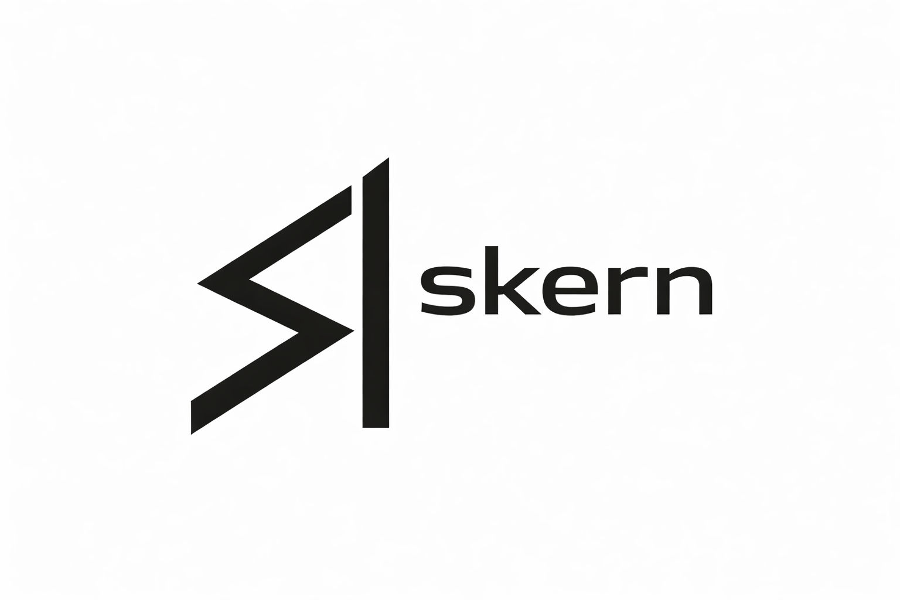

<p align="center">
  
</p>

<p align="center">
  <strong>System-wide skill registry for AI agents.</strong><br/>
  Forge, manage, and compose agent capabilities from the terminal.
</p>

<p align="center">
  <a href="https://github.com/devrimcavusoglu/skern/releases"></a>
  <a href="https://github.com/devrimcavusoglu/skern/blob/main/LICENSE"></a>
  
  <a href="https://agentskills.io"></a>
  <a href="https://skern.dev"></a>
</p>

---

Skern is a minimal, agent-first CLI for managing [Agent Skills](https://agentskills.io) across agentic development platforms. It provides a standardized lifecycle — create, validate, install, remove — for skills that work natively with **Claude Code**, **Codex CLI**, and **OpenCode**. Skills follow the Agent Skills open standard (`SKILL.md` with YAML frontmatter) and are immediately usable by any compatible platform without adapters or format conversion.

## Why skern?

Modern AI coding tools (Claude Code, Codex CLI, OpenCode) lack a standardized skill management layer. Each defines skills in its own directory structure, with no shared tooling for creation, validation, deduplication, or cross-platform installation.

skern provides:

- **Reusable skill definitions** — one `SKILL.md` per skill, portable across platforms
- **Project-scoped or system-scoped registration** — local skills for a repo, global skills for your machine
- **Overlap detection** — fuzzy matching prevents skill duplication before it happens
- **Cross-platform installation** — install to any supported platform with a single command
- **Agent-operable interface** — every command supports `--json`, enabling agents to manage their own skills

## Quick Example

```bash
# Initialize skill registry in your project
skern init

# Create a new skill
skern skill create code-review --description "Review PRs for style and correctness"

# Install to Claude Code
skern skill install code-review --platform claude-code

# Install to all detected platforms at once
skern skill install code-review --platform all

# List installed skills
skern skill list

# Search before creating — avoid duplicates
skern skill search "review"
```

## Features

- **Unified skill management** — one CLI to create, validate, search, install, and remove skills across all supported platforms
- **Agent Skills spec compliance** — reads and writes `SKILL.md` files directly, no proprietary format
- **Platform adapters** — install skills to Claude Code, Codex CLI, or OpenCode with a single command
- **Tool-forming loop** — agents can search for existing skills and scaffold new ones, turning recurring needs into reusable capabilities
- **Overlap detection** — fuzzy name matching and description similarity prevent skill duplication
- **JSON output** — every command supports `--json` for machine-readable output, making skern fully agent-operable

## Installation

### Quick install (Linux / macOS)

```sh
curl -fsSL https://raw.githubusercontent.com/devrimcavusoglu/skern/main/scripts/install.sh | bash
```

To install a specific version:

```sh
SKERN_VERSION=v0.0.1 curl -fsSL https://raw.githubusercontent.com/devrimcavusoglu/skern/main/scripts/install.sh | bash
```

### Go install

Requires Go 1.23+.

```sh
go install github.com/devrimcavusoglu/skern/cmd/skern@latest
```

### Build from repository

```sh
git clone https://github.com/devrimcavusoglu/skern.git
cd skern
make build
```

## Agent Setup

After installing skern, add a line to your project's `AGENTS.md` (or `CLAUDE.md`) so that agents know to use it for skill management:

```sh
echo 'Use skern to manage skills. Run `skern --help` for usage, `skern skill search <query>` to find existing skills before creating new ones.' >> AGENTS.md
```

This enables the [tool-forming loop](#features) — agents will search for existing skills before creating new ones, keeping your skill set deduplicated and organized.

## CLI Reference

```
skern init                                    # Initialize .skern/ in current project
skern skill create <name>                     # Scaffold a new skill
skern skill search <query>                    # Search skills by name/description
skern skill recommend <query>                 # Recommend: reuse, extend, or create
skern skill list [--scope user|project|all]   # List skills in registry
skern skill show <name>                       # Display skill details
skern skill validate <name>                   # Validate against Agent Skills spec
skern skill remove <name>                     # Remove skill from registry
skern skill install <name> --platform <p>     # Install skill to platform
skern skill uninstall <name> --platform <p>   # Remove skill from platform
skern platform list                           # List detected platforms
skern platform status                         # Skill x platform installation matrix
skern completion [bash|zsh|fish]              # Generate shell completions
skern version                                 # Print version info
```

**Global flags:** `--json`, `--quiet`, `--scope user|project`

**`skill create` flags:** `--author`, `--author-type human|agent`, `--author-platform`, `--description`, `--force` (bypass overlap block), `--from-template <path>` (use file as skill body)

**`skill recommend` flags:** `--name` (agent-suggested skill name), `--threshold` (minimum relevance, default 0.3), `--scope user|project|all`

**`skill install/uninstall` flags:** `--platform claude-code|codex-cli|opencode|all` (required), `--scope user|project`

**`platform status` flags:** `--scope user|project`

### Validation

`skern skill validate <name>` checks skills against the Agent Skills spec:

- **Name format** — must match `[a-z0-9]+(-[a-z0-9]+)*`, 1-64 characters
- **Description** — required, max 1024 characters
- **Body** — SKILL.md must have non-empty body content
- **Allowed-tools** — no empty entries
- **Metadata** — author type must be `human` or `agent`, version should follow semver

Validation also runs automatically during `skern skill create`, issuing warnings for any issues.

### Overlap Detection

When creating a skill, skern checks existing skills for similarity using:

- **Fuzzy name matching** — Levenshtein distance with prefix/suffix bonuses
- **Description similarity** — keyword overlap scoring (Jaccard similarity)
- **Tools overlap** — shared `allowed-tools` entries

| Score | Behavior |
|-------|----------|
| < 0.6 | Proceed normally |
| >= 0.6 | Warn — show similar skills, continue |
| >= 0.9 | Block — require `--force` to override |

Skill count warnings trigger at > 20 skills (project scope) or > 50 skills (user scope).

`skern skill list` also runs pairwise overlap detection across all listed skills and appends a "Potential duplicates" section when matches are found (score >= 0.6). In `--json` mode, these appear in the `duplicates` array.

### Author Provenance

Skills track author metadata and an optional `modified-by` history. `skern skill show` displays the full provenance chain when present, including editor name, type (human/agent), platform, and date.

## Architecture

```
Skill Author --> skern --> Registry --> Agent Runtime
                  |
          +-------+-------+
          |       |       |
        Claude  Codex   OpenCode
         Code    CLI
```

skern separates concerns into four layers:

- **Skill Definition** — metadata + behavior in a single `SKILL.md` file
- **Skill Registry** — project-scoped (`.skern/skills/`) or user-scoped (`~/.skern/skills/`)
- **Validation** — spec compliance checks, overlap detection, provenance tracking
- **Platform Adapters** — install/uninstall to any supported agent runtime

## Supported Platforms

| Platform | User-level skills | Project-level skills |
|----------|-------------------|----------------------|
| Claude Code | `~/.claude/skills/<name>/` | `.claude/skills/<name>/` |
| Codex CLI | `~/.agents/skills/<name>/` | `.agents/skills/<name>/` |
| OpenCode | `~/.config/opencode/skills/<name>/` | `.opencode/skills/<name>/` |

Skern auto-detects which platforms are installed. Use `--platform all` to install a skill to every detected platform at once.

## Comparison

| Feature | skern | Manual Folder Skills | AI Tool Built-in |
|---------|-------|----------------------|------------------|
| System-wide registry | Yes | No | No |
| Cross-platform install | Yes | No | No |
| Overlap detection | Yes | No | No |
| CLI-first | Yes | Partial | No |
| Agent-agnostic | Yes | Partial | No |
| Validation | Yes | No | No |
| Versioning | Planned | No | No |

## Design Principles

- **CLI-first** — terminal is the primary interface
- **File-system native** — skills are files, registries are directories
- **Agent-agnostic** — works with any platform that reads `SKILL.md`
- **Deterministic outputs** — same input, same result
- **Minimal dependencies** — small binary, fast startup
- **No cloud lock-in** — everything is local, everything is yours

## Philosophy

Skills should not live inside models.
They should live in code.
Versioned. Composable. Auditable. Portable.

## Roadmap

- [ ] Skill dependency resolution
- [ ] Versioned skill packages
- [ ] Remote skill registry
- [ ] Signed skill manifests
- [ ] Additional agent runtime adapters

## Development

```sh
make build        # Build binary
make test         # Unit tests
make test-v       # Verbose test output
make test-cover   # Coverage report
make test-smoke   # Smoke & E2E tests against built binary
make lint         # golangci-lint
make fmt          # gofmt
make clean        # Remove build artifacts
```

### Manual Agent Test Harness

The `tests/manual/` directory contains 10 scenarios that test how AI agents interact with skern — discovery, command chaining, JSON parsing, error handling, and dedup reasoning. Run these before releases.

```sh
# 1. Set up isolated test environments in /tmp
make test-manual-setup

# 2. Test each scenario with your AI agent
cd /tmp/skern-manual-tests/01-fresh-project
cat PROMPT.md      # Read what to ask the agent
cat EXPECTED.md    # Read the pass criteria
# Open your AI agent and run the prompt
# Repeat for each scenario (01 through 10)

# 3. Generate a markdown report (interactive pass/fail checklist)
make test-manual-report

# 4. Clean up temp dirs and platform markers
make test-manual-teardown
```

Each scenario directory contains `AGENTS.md` (agent instructions), `PROMPT.md` (what to ask), and `EXPECTED.md` (pass/fail checklist). See [`tests/manual/README.md`](tests/manual/README.md) for full details.

## License

Apache 2.0 — see [LICENSE](LICENSE) for details.
